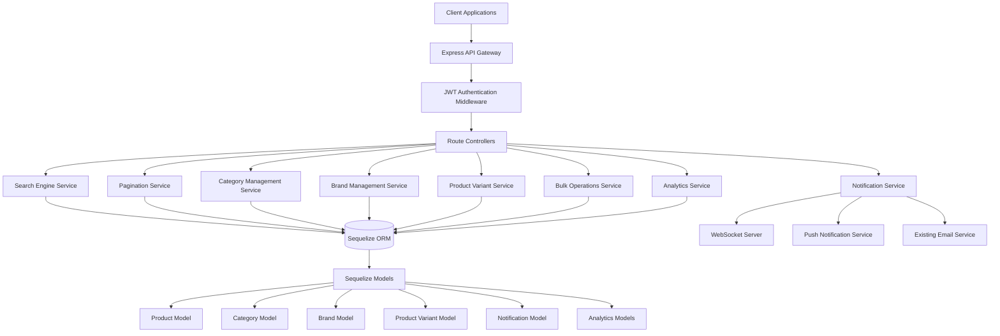

# Design Document: Advanced E-commerce Features

## Overview

This design document outlines the implementation of advanced e-commerce features for a beauty shop application built on Node.js/Express with Sequelize ORM. The system will extend the existing architecture with sophisticated search capabilities, efficient data management, real-time notifications via WebSockets, and comprehensive analytics to enhance both customer experience and business operations.

The design leverages the existing infrastructure including JWT authentication, Cloudinary image uploads, and email services while introducing new components for search, pagination, category/brand management, product variants, bulk operations, notifications, and analytics.

## Architecture

### High-Level Architecture



### Service Layer Architecture

The design follows a service-oriented architecture pattern where each major feature is encapsulated in a dedicated service:

- **Search Engine Service**: Handles product search with advanced filtering
- **Pagination Service**: Manages efficient data pagination across all entities
- **Category Management Service**: Handles hierarchical category operations
- **Brand Management Service**: Manages brand data and relationships
- **Product Variant Service**: Handles product variations and inventory
- **Bulk Operations Service**: Processes multi-item administrative operations
- **Notification Service**: Manages real-time and push notifications
- **Analytics Service**: Generates reports and business insights

## Components and Interfaces

### 1. Search Engine Service

**Purpose**: Provides advanced product search with filtering capabilities

**Interface**:
```javascript
class SearchEngineService {
  async searchProducts(query, filters, pagination)
  async buildSearchQuery(searchTerm, filters)
  async applyFilters(queryBuilder, filters)
  async calculateRelevanceScore(products, searchTerm)
}
```

**Key Features**:
- Full-text search across product names, descriptions, and tags
- Multi-dimensional filtering (category, brand, price, ratings)
- Relevance scoring algorithm
- Integration with pagination system
- Performance optimization with database indexing

### 2. Pagination Service

**Purpose**: Handles efficient pagination for large datasets

**Interface**:
```javascript
class PaginationService {
  async paginateResults(query, page, limit, orderBy)
  async getCursorBasedPagination(query, cursor, limit)
  async getPaginationMetadata(totalCount, page, limit)
  validatePaginationParams(page, limit)
}
```

**Key Features**:
- Offset-based pagination for small to medium datasets
- Cursor-based pagination for large datasets (>10,000 items)
- Consistent ordering to prevent duplicates
- Metadata generation (total pages, current page, etc.)

### 3. Category Management Service

**Purpose**: Manages hierarchical product categories

**Interface**:
```javascript
class CategoryService {
  async createCategory(categoryData, parentId)
  async updateCategory(categoryId, updateData)
  async deleteCategory(categoryId)
  async getCategoryHierarchy()
  async getCategoryWithProductCount(categoryId)
  async validateCategoryHierarchy(categoryId, parentId)
}
```

**Key Features**:
- Hierarchical category structure (up to 3 levels)
- Parent-child relationship management
- Category validation and constraint enforcement
- Product count aggregation
- Bulk category operations support

### 4. Brand Management Service

**Purpose**: Manages product brands and their relationships

**Interface**:
```javascript
class BrandService {
  async createBrand(brandData)
  async updateBrand(brandId, updateData)
  async deleteBrand(brandId)
  async getBrandWithProductCount(brandId)
  async activateBrand(brandId)
  async deactivateBrand(brandId)
}
```

**Key Features**:
- Brand metadata management (name, description, logo)
- Brand activation/deactivation
- Product association tracking
- Brand validation and uniqueness constraints

### 5. Product Variant Service

**Purpose**: Handles product variations and variant-specific inventory

**Interface**:
```javascript
class VariantService {
  async createProductVariant(productId, variantData)
  async updateVariant(variantId, updateData)
  async getVariantsByProduct(productId)
  async checkVariantAvailability(variantId)
  async updateVariantStock(variantId, quantity)
  async validateVariantCombination(productId, attributes)
}
```

**Key Features**:
- Multi-attribute variant support (size, color, material, etc.)
- Variant-specific pricing and inventory
- Unique combination validation
- Stock level tracking per variant
- Availability status management

### 6. Bulk Operations Service

**Purpose**: Processes administrative operations on multiple items

**Interface**:
```javascript
class BulkOperationsService {
  async bulkUpdateProducts(productIds, updateData)
  async bulkDeleteItems(entityType, itemIds)
  async bulkPriceUpdate(productIds, priceData)
  async bulkInventoryUpdate(items)
  async getBulkOperationStatus(operationId)
  async validateBulkOperation(operation)
}
```

**Key Features**:
- Batch processing with transaction support
- Progress tracking for long-running operations
- Error handling and rollback capabilities
- Audit logging for all bulk operations
- Validation before execution

### 7. Notification Service

**Purpose**: Manages real-time notifications and push notifications

**Interface**:
```javascript
class NotificationService {
  async sendRealTimeNotification(userId, notification)
  async sendPushNotification(deviceTokens, notification)
  async createNotification(notificationData)
  async getNotificationHistory(userId, pagination)
  async markNotificationAsRead(notificationId)
  async configureNotificationPreferences(userId, preferences)
}
```

**Key Features**:
- WebSocket-based real-time notifications
- Push notification integration
- Notification queuing for offline users
- User preference management
- Notification history and status tracking

### 8. Analytics Service

**Purpose**: Generates business reports and insights

**Interface**:
```javascript
class AnalyticsService {
  async generateSalesReport(dateRange, filters)
  async getCustomerAnalytics(dateRange)
  async getProductPerformanceMetrics(productIds, dateRange)
  async getRevenueTracking(period, groupBy)
  async exportReport(reportType, format, filters)
  async calculateKPIs(dateRange)
}
```

**Key Features**:
- Sales analytics with multiple dimensions
- Customer behavior analysis
- Product performance metrics
- Revenue tracking and forecasting
- Report export capabilities (CSV, PDF)

## Data Models

### Enhanced Product Model

```javascript
// Existing Product model extended with new relationships
Product.associate = (models) => {
  Product.belongsTo(models.Category, { foreignKey: 'categoryId' });
  Product.belongsTo(models.Brand, { foreignKey: 'brandId' });
  Product.hasMany(models.ProductVariant, { foreignKey: 'productId' });
  Product.hasMany(models.ProductView, { foreignKey: 'productId' });
  // ... existing associations
};
```

### New Category Model

```javascript
const Category = sequelize.define('Category', {
  id: { type: DataTypes.INTEGER, primaryKey: true, autoIncrement: true },
  name: { type: DataTypes.STRING, allowNull: false },
  slug: { type: DataTypes.STRING, unique: true, allowNull: false },
  description: DataTypes.TEXT,
  parentId: { type: DataTypes.INTEGER, references: { model: 'Categories', key: 'id' } },
  level: { type: DataTypes.INTEGER, defaultValue: 1 },
  isActive: { type: DataTypes.BOOLEAN, defaultValue: true },
  sortOrder: { type: DataTypes.INTEGER, defaultValue: 0 },
  createdAt: DataTypes.DATE,
  updatedAt: DataTypes.DATE
});

Category.associate = (models) => {
  Category.belongsTo(models.Category, { as: 'Parent', foreignKey: 'parentId' });
  Category.hasMany(models.Category, { as: 'Children', foreignKey: 'parentId' });
  Category.hasMany(models.Product, { foreignKey: 'categoryId' });
};
```

### New Brand Model

```javascript
const Brand = sequelize.define('Brand', {
  id: { type: DataTypes.INTEGER, primaryKey: true, autoIncrement: true },
  name: { type: DataTypes.STRING, allowNull: false, unique: true },
  slug: { type: DataTypes.STRING, unique: true, allowNull: false },
  description: DataTypes.TEXT,
  logoUrl: DataTypes.STRING,
  website: DataTypes.STRING,
  isActive: { type: DataTypes.BOOLEAN, defaultValue: true },
  createdAt: DataTypes.DATE,
  updatedAt: DataTypes.DATE
});

Brand.associate = (models) => {
  Brand.hasMany(models.Product, { foreignKey: 'brandId' });
};
```

### New Product Variant Model

```javascript
const ProductVariant = sequelize.define('ProductVariant', {
  id: { type: DataTypes.INTEGER, primaryKey: true, autoIncrement: true },
  productId: { type: DataTypes.INTEGER, allowNull: false },
  sku: { type: DataTypes.STRING, unique: true, allowNull: false },
  attributes: { type: DataTypes.JSON, allowNull: false }, // {size: 'M', color: 'Red'}
  price: { type: DataTypes.DECIMAL(10, 2) },
  comparePrice: { type: DataTypes.DECIMAL(10, 2) },
  stock: { type: DataTypes.INTEGER, defaultValue: 0 },
  lowStockThreshold: { type: DataTypes.INTEGER, defaultValue: 5 },
  isActive: { type: DataTypes.BOOLEAN, defaultValue: true },
  weight: DataTypes.DECIMAL(8, 2),
  dimensions: DataTypes.JSON, // {length, width, height}
  createdAt: DataTypes.DATE,
  updatedAt: DataTypes.DATE
});

ProductVariant.associate = (models) => {
  ProductVariant.belongsTo(models.Product, { foreignKey: 'productId' });
  ProductVariant.hasMany(models.OrderItem, { foreignKey: 'variantId' });
  ProductVariant.hasMany(models.CartItem, { foreignKey: 'variantId' });
};
```

### New Notification Model

```javascript
const Notification = sequelize.define('Notification', {
  id: { type: DataTypes.INTEGER, primaryKey: true, autoIncrement: true },
  userId: DataTypes.INTEGER,
  type: { type: DataTypes.ENUM('order_update', 'stock_alert', 'promotion', 'system'), allowNull: false },
  title: { type: DataTypes.STRING, allowNull: false },
  message: { type: DataTypes.TEXT, allowNull: false },
  data: DataTypes.JSON, // Additional context data
  isRead: { type: DataTypes.BOOLEAN, defaultValue: false },
  deliveryMethod: { type: DataTypes.ENUM('realtime', 'push', 'email'), allowNull: false },
  deliveryStatus: { type: DataTypes.ENUM('pending', 'sent', 'delivered', 'failed'), defaultValue: 'pending' },
  scheduledAt: DataTypes.DATE,
  sentAt: DataTypes.DATE,
  createdAt: DataTypes.DATE,
  updatedAt: DataTypes.DATE
});

Notification.associate = (models) => {
  Notification.belongsTo(models.User, { foreignKey: 'userId' });
};
```

### Analytics Models

```javascript
// Product Views Tracking
const ProductView = sequelize.define('ProductView', {
  id: { type: DataTypes.INTEGER, primaryKey: true, autoIncrement: true },
  productId: { type: DataTypes.INTEGER, allowNull: false },
  userId: DataTypes.INTEGER,
  sessionId: DataTypes.STRING,
  ipAddress: DataTypes.STRING,
  userAgent: DataTypes.TEXT,
  referrer: DataTypes.STRING,
  viewedAt: { type: DataTypes.DATE, defaultValue: DataTypes.NOW }
});

// Sales Analytics Aggregation
const SalesAnalytics = sequelize.define('SalesAnalytics', {
  id: { type: DataTypes.INTEGER, primaryKey: true, autoIncrement: true },
  date: { type: DataTypes.DATEONLY, allowNull: false },
  totalRevenue: { type: DataTypes.DECIMAL(12, 2), defaultValue: 0 },
  totalOrders: { type: DataTypes.INTEGER, defaultValue: 0 },
  totalCustomers: { type: DataTypes.INTEGER, defaultValue: 0 },
  averageOrderValue: { type: DataTypes.DECIMAL(10, 2), defaultValue: 0 },
  categoryBreakdown: DataTypes.JSON,
  brandBreakdown: DataTypes.JSON,
  createdAt: DataTypes.DATE,
  updatedAt: DataTypes.DATE
});
```

## Error Handling

### Error Classification

1. **Validation Errors**: Invalid input data, constraint violations
2. **Business Logic Errors**: Stock insufficient, category hierarchy violations
3. **System Errors**: Database connection issues, external service failures
4. **Authentication/Authorization Errors**: Invalid tokens, insufficient permissions

### Error Response Format

```javascript
{
  success: false,
  error: {
    code: 'VALIDATION_ERROR',
    message: 'Human-readable error message',
    details: {
      field: 'specific field that caused the error',
      value: 'invalid value',
      constraint: 'validation rule that was violated'
    },
    timestamp: '2024-01-15T10:30:00Z',
    requestId: 'unique-request-identifier'
  }
}
```

### Error Handling Strategies

- **Graceful Degradation**: Search falls back to basic filtering if advanced search fails
- **Transaction Rollback**: Bulk operations use database transactions for atomicity
- **Retry Logic**: Notification delivery includes retry mechanisms
- **Circuit Breaker**: External service calls implement circuit breaker pattern
- **Logging**: Comprehensive error logging for debugging and monitoring

## Testing Strategy

### Dual Testing Approach

The testing strategy employs both unit testing and property-based testing to ensure comprehensive coverage:

**Unit Testing**:
- Specific examples and edge cases
- Integration points between services
- Error condition handling
- Mock external dependencies

**Property-Based Testing**:
- Universal properties across all inputs
- Comprehensive input coverage through randomization
- Minimum 100 iterations per property test
- Each test references design document properties

### Testing Configuration

- **Framework**: Jest for unit tests, fast-check for property-based tests
- **Coverage Target**: 90% code coverage minimum
- **Test Environment**: Separate test database with seed data
- **CI/CD Integration**: Automated testing on all pull requests
- **Performance Testing**: Load testing for search and analytics endpoints

### Property Test Tagging

Each property-based test must include a comment tag referencing the design property:
```javascript
// Feature: advanced-ecommerce-features, Property 1: Search result consistency
```
## Correctness Properties

*A property is a characteristic or behavior that should hold true across all valid executions of a system—essentially, a formal statement about what the system should do. Properties serve as the bridge between human-readable specifications and machine-verifiable correctness guarantees.*

### Property Reflection

After analyzing all acceptance criteria, I identified several areas where properties can be consolidated to eliminate redundancy:

- **Search filtering properties (1.2-1.6)** can be combined into a comprehensive multi-filter property
- **Category and Brand management properties** share similar patterns for CRUD operations and can be streamlined
- **Notification delivery properties** across different types can be unified
- **Analytics calculation properties** share common calculation accuracy patterns

### Core Properties

**Property 1: Search Result Relevance and Filtering**
*For any* search query with any combination of filters (category, brand, price range, rating), all returned products should satisfy every applied filter condition and be ranked by relevance score in descending order
**Validates: Requirements 1.1, 1.2, 1.3, 1.4, 1.5, 1.6**

**Property 2: Pagination Consistency**
*For any* dataset and pagination parameters, paginating through all pages should return every item exactly once without duplicates or omissions, maintaining consistent ordering throughout
**Validates: Requirements 2.2, 2.3**

**Property 3: Pagination Metadata Accuracy**
*For any* dataset and page request, the pagination metadata (total count, current page, total pages, has next/previous) should accurately reflect the actual dataset state
**Validates: Requirements 2.1, 2.5**

**Property 4: Large Dataset Performance Optimization**
*For any* dataset exceeding 10,000 items, the pagination system should automatically use cursor-based pagination and maintain sub-second response times
**Validates: Requirements 2.6**

**Property 5: Hierarchical Category Integrity**
*For any* category hierarchy operations (create, update, delete), the parent-child relationships should remain valid with no orphaned categories and maximum depth of 3 levels
**Validates: Requirements 3.2, 3.6**

**Property 6: Category Uniqueness Within Level**
*For any* category creation or update within a parent level, category names should be unique within that specific parent scope
**Validates: Requirements 3.1**

**Property 7: Referential Integrity Protection**
*For any* attempt to delete categories or brands with associated products, the operation should be prevented and return a descriptive error message
**Validates: Requirements 3.4, 4.3**

**Property 8: Cascade Update Consistency**
*For any* category or brand update, all associated product relationships should be updated atomically to maintain referential consistency
**Validates: Requirements 3.3, 4.2**

**Property 9: Brand Uniqueness**
*For any* brand creation or update, brand names should be globally unique across the entire system
**Validates: Requirements 4.1**

**Property 10: Product Variant Uniqueness**
*For any* product, variant attribute combinations should be unique within that product scope, preventing duplicate variants
**Validates: Requirements 5.1**

**Property 11: Variant-Specific Data Integrity**
*For any* product variant selection, the returned data (price, stock, availability) should be specific to that exact variant combination
**Validates: Requirements 5.2, 5.5, 5.6**

**Property 12: Stock Status Consistency**
*For any* variant with zero stock, the availability status should be marked as unavailable while preserving all variant data
**Validates: Requirements 5.3**

**Property 13: Bulk Operation Atomicity**
*For any* bulk operation, either all items should be processed successfully or all changes should be rolled back, with detailed error reporting for any failures
**Validates: Requirements 6.1, 6.2, 6.3**

**Property 14: Bulk Operation Audit Trail**
*For any* bulk operation performed, all changes should be logged with timestamp, user, and affected items for complete audit traceability
**Validates: Requirements 6.5**

**Property 15: Real-time Notification Delivery**
*For any* system event that triggers notifications (order status change, stock alert), all eligible users should receive notifications through their preferred channels within 5 seconds
**Validates: Requirements 7.2, 7.3, 8.1, 8.2**

**Property 16: Notification Queuing for Offline Users**
*For any* user who is offline when notifications are sent, those notifications should be queued and delivered immediately upon their next connection
**Validates: Requirements 7.5**

**Property 17: Notification Preference Compliance**
*For any* user with configured notification preferences, only notifications matching their preferences should be delivered, respecting opt-out choices
**Validates: Requirements 7.6, 9.4, 9.6**

**Property 18: Duplicate Alert Prevention**
*For any* low stock condition, duplicate alerts for the same product/variant should be prevented within a 24-hour window
**Validates: Requirements 8.5**

**Property 19: Push Notification Device Management**
*For any* customer opt-in or opt-out action, device tokens should be immediately registered or deregistered for push notification delivery
**Validates: Requirements 9.1, 9.4**

**Property 20: Analytics Calculation Accuracy**
*For any* sales data and time period, calculated metrics (revenue, order count, average order value, conversion rates) should be mathematically accurate and consistent across different report views
**Validates: Requirements 10.1, 10.7, 13.1, 13.5**

**Property 21: Analytics Time Period Filtering**
*For any* analytics query with time period filters, only data within the specified date range should be included in calculations and reports
**Validates: Requirements 10.2, 13.1**

**Property 22: Analytics Data Completeness**
*For any* analytics report generation, all required breakdowns (categories, brands, customer segments) and metadata should be included without missing data
**Validates: Requirements 10.3, 11.4, 12.4, 13.3**

**Property 23: Customer Data Anonymization**
*For any* customer analytics report, all personally identifiable information should be anonymized while preserving analytical value
**Validates: Requirements 11.7**

**Property 24: Revenue Adjustment Accounting**
*For any* revenue calculation, refunds, cancellations, and discounts should be properly accounted for to ensure accurate net revenue reporting
**Validates: Requirements 13.2**

**Property 25: Export Format Consistency**
*For any* report export request, the data should be accurately formatted and complete in both CSV and PDF formats without data loss
**Validates: Requirements 10.6**

### Edge Case Properties

**Property 26: Empty Dataset Handling**
*For any* search, pagination, or analytics operation on empty datasets, the system should return appropriate empty results with correct metadata rather than errors

**Property 27: Concurrent Modification Handling**
*For any* bulk operation or pagination occurring during concurrent data modifications, the system should handle changes gracefully without data corruption

**Property 28: Notification Delivery Failure Recovery**
*For any* failed notification delivery attempt, the system should implement exponential backoff retry logic and eventual fallback to alternative delivery methods

### Round-Trip Properties

**Property 29: Search Filter Round-Trip**
*For any* product that matches specific filter criteria, applying those same filters in a search should return that product in the results

**Property 30: Category Hierarchy Round-Trip**
*For any* valid category hierarchy, serializing the hierarchy to JSON and deserializing it should produce an equivalent hierarchy structure

**Property 31: Analytics Data Export Round-Trip**
*For any* analytics report exported to CSV format, importing that CSV should reproduce the same analytical insights and calculations